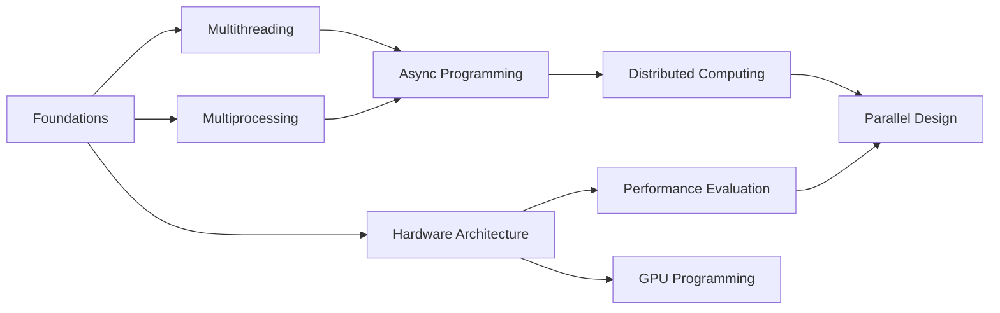

<div align="center">

# 🚀 Parallel and Concurrent Programming

### *Master the Art of High-Performance Computing*

[](https://opensource.org/licenses/MIT)
[](https://www.python.org/)
[](https://isocpp.org/)
[](https://www.javascript.com/)
[](http://makeapullrequest.com)

*Unlock the full potential of modern hardware with comprehensive guides, practical examples, and hands-on exercises*


[📚 Documentation](#learning-path) • [💻 Code Examples](#code-examples) • [🎯 Quizzes](#interactive-quizzes) • [🤝 Contributing](#contributing)

</div>

---

## 📋 Table of Contents

- [Overview](#-overview)
- [Core Concepts](#-core-concepts)
- [Learning Path](#-learning-path)
- [Code Examples](#-code-examples)
- [Interactive Quizzes](#-interactive-quizzes)
- [Performance Analysis](#-performance-analysis)
- [Practical Applications](#-practical-applications)
- [Getting Started](#-getting-started)
- [Essential Resources](#-essential-resources)
- [Contributing](#-contributing)
- [License](#-license)

---

## 🌟 Overview

Parallel and concurrent programming unlock the full potential of modern hardware, enabling applications to perform multiple tasks simultaneously. While these concepts might seem intimidating at first, understanding their fundamentals is crucial for building efficient, responsive software that can handle today's computational demands.

**What you'll learn:**
- 🔄 Design and implement concurrent systems
- ⚡ Write high-performance parallel algorithms
- 🔧 Master multithreading and multiprocessing
- 🌐 Build distributed computing applications
- 📊 Analyze and optimize performance
- 🎮 Leverage GPU computing capabilities

## 🧠 Core Concepts

Understanding parallel and concurrent programming begins with grasping the distinction between these approaches and sequential programming:

| Concept | Description | Key Characteristic |
|---------|-------------|-------------------|
| **Sequential Programming** | Executes instructions one after another in a single thread | Single path of execution |
| **Concurrent Programming** | Manages multiple tasks that may overlap in time | Dealing with lots of things at once |
| **Parallel Programming** | Executes multiple tasks simultaneously across multiple cores | Doing lots of things at once |

> 💡 **Key Insight**: Concurrency is about *structure* (dealing with multiple tasks), while parallelism is about *execution* (running multiple tasks simultaneously).

### Quick Example

```python
# Sequential: Tasks run one after another
task1()
task2()
task3()

# Concurrent: Tasks can overlap in time
async def concurrent_execution():
    await asyncio.gather(task1(), task2(), task3())

# Parallel: Tasks run simultaneously on different cores
with multiprocessing.Pool() as pool:
    pool.map(process_task, [task1, task2, task3])
```

## 📚 Learning Path

Progress through these topics to build a comprehensive understanding of parallel and concurrent programming:

| # | Topic | Focus Area | Difficulty | Resource |
|---|-------|------------|------------|----------|
| 1️⃣ | **Foundations** | Basic terminology, processes vs threads, synchronization primitives | 🟢 Beginner | [Basic Terminology](notes/01_basic_terminology.md) |
| 2️⃣ | **Multithreading** | Thread creation, management, synchronization, and safety patterns | 🟢 Beginner | [Multithreading](notes/02_multithreading.md) |
| 3️⃣ | **Multiprocessing** | Process management, inter-process communication, shared memory | 🟡 Intermediate | [Multiprocessing](notes/03_multiprocessing.md) |
| 4️⃣ | **Async Programming** | Event loops, async/await patterns, non-blocking I/O operations | 🟡 Intermediate | [Asynchronous Programming](notes/04_asynchronous_programming.md) |
| 5️⃣ | **Distributed Computing** | Message Passing Interface (MPI), cluster computing, communication patterns | 🔴 Advanced | [MPI Programming](notes/05_mpi.md) |
| 6️⃣ | **Hardware Architecture** | Multi-core systems, memory hierarchies, GPU computing, performance considerations | 🟡 Intermediate | [Hardware Foundations](notes/06_hardware.md) |
| 7️⃣ | **Performance Evaluation** | Benchmarking, profiling, Amdahl's Law, speedup analysis | 🔴 Advanced | [Evaluating Performance](notes/07_evaluating_performance.md) |
| 8️⃣ | **Parallel Design** | Design patterns, algorithms, load balancing, scalability | 🔴 Advanced | [Designing Parallel Programs](notes/08_designing_parallel_programs.md) |
| 9️⃣ | **GPU Programming** | CUDA, OpenCL, GPU architectures, kernel optimization | 🔴 Advanced | [GPU Programming](notes/09_gpu_programming.md) |

### 🎯 Recommended Learning Sequence



## 💻 Code Examples

This repository includes practical implementations in multiple programming languages:

### 📁 Repository Structure

```
src/
├── 🐍 python/          # Python implementations
│   ├── mpi/           # MPI examples (14+ examples)
│   ├── asynchrony/    # Async/await patterns
│   ├── threads/       # Threading examples
│   └── processes/     # Multiprocessing examples
│
├── ⚙️ cpp/             # C++ implementations
│   ├── threads/       # POSIX threads, std::thread
│   ├── parallel/      # OpenMP, TBB examples
│   └── cuda/          # GPU programming
│
└── 🟨 js/              # JavaScript/Node.js
    ├── async/         # Promises, async/await
    ├── workers/       # Web Workers
    └── cluster/       # Node.js clustering
```

### 🔥 Featured Examples

<details>
<summary><b>🔄 MPI - Parallel Matrix Multiplication</b></summary>

Distributed matrix multiplication using Message Passing Interface:
```python
# Example: Parallel computation across multiple processes
mpiexec -n 4 python src/python/mpi/parallel_matrix_multiplication.py
```
</details>

<details>
<summary><b>⚡ Async - Parallel Web Fetching</b></summary>

Asynchronous HTTP requests with modern async/await:
```python
# Example: Fetch multiple URLs concurrently
python src/python/asynchrony/fetch_parallel.py
```
</details>

<details>
<summary><b>🧵 Multithreading - Producer-Consumer</b></summary>

Classic synchronization pattern with thread-safe queues:
```python
# Example: Thread coordination with locks and conditions
python src/python/threads/producer_consumer.py
```
</details>

### 🚀 Quick Start

```bash
# Clone the repository
git clone https://github.com/djeada/Parallel-And-Concurrent-Programming.git
cd Parallel-And-Concurrent-Programming

# Run Python examples
python src/python/asynchrony/async_generator.py

# Run C++ examples (requires compilation)
g++ -pthread src/cpp/threads/basic_thread.cpp -o thread_demo
./thread_demo

# Run JavaScript examples
node src/js/async/promises_example.js
```

## 🎯 Interactive Quizzes

Test your understanding with interactive quizzes for each topic:

| Quiz | Topic | Questions | Link |
|------|-------|-----------|------|
| 📝 | Basic Terminology | Processes, threads, synchronization | [Quiz 1](quizzes/01_basic_terminology.md) |
| 📝 | Threading Concepts | Thread safety, deadlocks, race conditions | [Quiz 2](quizzes/02_threading.md) |
| 📝 | Process Management | IPC, shared memory, process pools | [Quiz 3](quizzes/03_processes.md) |
| 📝 | Async Patterns | Event loops, futures, coroutines | [Quiz 4](quizzes/04_async.md) |
| 📝 | Distributed Systems | MPI, communication patterns, synchronization | [Quiz 5](quizzes/05_distributed.md) |
| 📝 | Hardware & Architecture | CPU caches, memory models, NUMA | [Quiz 6](quizzes/06_hardware.md) |
| 📝 | Performance Analysis | Benchmarking, profiling, optimization | [Quiz 7](quizzes/07_performance.md) |
| 📝 | Parallel Design Patterns | Algorithms, load balancing, scalability | [Quiz 8](quizzes/08_parallel_design.md) |

## 📊 Performance Analysis

Explore performance evaluation tools and scripts:

### Available Analysis Scripts

| Script | Description | Concepts |
|--------|-------------|----------|
| 🎯 [Amdahl's Law](scripts/amdahls_law/) | Calculate theoretical speedup limits | Maximum speedup with parallel portions |
| 🎯 [Gustafson's Law](scripts/gustafsons_law/) | Scaled speedup analysis | Speedup with increasing problem size |
| 📈 [Speedup Efficiency](scripts/speedup_efficiency/) | Measure parallel efficiency | Strong vs weak scaling |
| 🔄 [Communication Overhead](scripts/communication_overhead/) | Analyze synchronization costs | Network latency, bandwidth impact |
| 🧩 [Granularity Analysis](scripts/granularity_analysis/) | Task size optimization | Fine-grained vs coarse-grained parallelism |
| 💾 [Memory Bandwidth](scripts/memory_bandwidth/) | Memory system performance | Cache effects, bandwidth limitations |

### Performance Metrics

```python
# Example: Calculate speedup and efficiency
speedup = sequential_time / parallel_time
efficiency = speedup / number_of_processors
parallel_overhead = parallel_time - (sequential_time / number_of_processors)
```

## 🎯 Practical Applications

These concepts apply across various domains:

| Domain | Use Cases | Technologies |
|--------|-----------|--------------|
| 🌐 **Web Development** | • Concurrent user request handling<br>• Database connection pooling<br>• Real-time data processing | Node.js cluster, async/await, Web Workers |
| 🔬 **Scientific Computing** | • Parallel simulations<br>• Data processing pipelines<br>• Numerical analysis | MPI, OpenMP, NumPy, SciPy |
| 🎮 **Game Development** | • Physics calculations<br>• AI processing<br>• Rendering pipelines | Multi-threading, SIMD, GPU compute |
| 📊 **Data Science** | • Parallel data processing<br>• Distributed machine learning<br>• ETL pipelines | Dask, Ray, Spark, parallel pandas |
| 💻 **System Programming** | • Operating system kernels<br>• Device drivers<br>• Network protocols | POSIX threads, async I/O, kernel threads |
| 🤖 **Machine Learning** | • Model training parallelization<br>• Hyperparameter tuning<br>• Inference optimization | TensorFlow, PyTorch, CUDA, distributed training |
| 📱 **Mobile Development** | • Background task processing<br>• Image processing<br>• Network operations | Coroutines, GCD, async patterns |

## 🚀 Getting Started

### Prerequisites

Before diving into parallel and concurrent programming, ensure you have:

- ✅ Basic programming knowledge in Python, C++, or JavaScript
- ✅ Understanding of algorithms and data structures
- ✅ Familiarity with command-line tools
- ✅ Development environment set up for your chosen language

### Learning Strategy

```
📖 Read Theory → 💻 Write Code → 🧪 Run Examples → 📊 Analyze Performance → 🔄 Iterate
```

1. **🎯 Start with the basics**
   - Understand processes, threads, and synchronization
   - Learn about race conditions and deadlocks
   - Study synchronization primitives (locks, semaphores, barriers)

2. **💡 Practice with simple examples**
   - Implement basic producer-consumer patterns
   - Create thread-safe data structures
   - Experiment with different synchronization techniques

3. **🔧 Explore language-specific tools**
   - Python: `threading`, `multiprocessing`, `asyncio`
   - C++: `std::thread`, OpenMP, TBB
   - JavaScript: Promises, async/await, Web Workers

4. **🏗️ Build real projects**
   - Apply concepts to actual problems
   - Measure and optimize performance
   - Learn from mistakes and edge cases

5. **📈 Study performance**
   - Profile your code with appropriate tools
   - Understand Amdahl's and Gustafson's laws
   - Optimize based on measurements, not assumptions

### 🛠️ Tools and Environment Setup

<details>
<summary><b>Python Setup</b></summary>

```bash
# Install MPI for distributed computing
sudo apt-get install mpich
pip install mpi4py

# Install async libraries
pip install aiohttp asyncio

# Performance profiling
pip install line_profiler memory_profiler
```
</details>

<details>
<summary><b>C++ Setup</b></summary>

```bash
# Install compiler with C++11 support
sudo apt-get install g++ cmake

# Install OpenMP (usually included with GCC)
# Install Intel TBB
sudo apt-get install libtbb-dev

# CUDA for GPU programming
# Download from NVIDIA website
```
</details>

<details>
<summary><b>JavaScript Setup</b></summary>

```bash
# Install Node.js
curl -fsSL https://deb.nodesource.com/setup_lts.x | sudo -E bash -
sudo apt-get install -y nodejs

# Install useful packages
npm install -g clinic autocannon
```
</details>

## 📚 Essential Resources

### 📖 Books and Documentation

| Resource | Focus | Level |
|----------|-------|-------|
| [Operating Systems Concepts](https://www.personal.kent.edu/~rmuhamma/OpSystems/os.html) | Foundational OS knowledge | 🟢 Beginner |
| [The Art of Computer Programming](https://www.oreilly.com/library/view/the-art-of/9780596802424/) | Algorithmic foundations | 🔴 Advanced |
| [Asynchronous Programming with C++](https://www.packtpub.com/) | Modern C++ async patterns | 🟡 Intermediate |

### 🎓 Academic Resources

| Resource | Institution | Topics |
|----------|-------------|--------|
| [Parallel Programming Bootcamp](https://princetonuniversity.github.io/PUbootcamp/sessions/parallel-programming/) | Princeton University | Comprehensive parallel programming |
| [CS152 Computer Architecture](https://inst.eecs.berkeley.edu/~cs152/fa16/lectures/) | UC Berkeley | Hardware architecture insights |
| [Concurrent Systems](https://w3.cs.jmu.edu/kirkpams/OpenCSF/Books/csf/html/) | JMU | Systems programming perspective |

### 🔧 Language-Specific Resources

<details>
<summary><b>🐍 Python Resources</b></summary>

- [Understanding Python Asyncio](https://lucumr.pocoo.org/2016/10/30/i-dont-understand-asyncio/) - Deep dive into async
- [Raymond's PyBay Keynote](https://pybay.com/site_media/slides/raymond2017-keynote/index.html) - Concurrency insights
- [Python Threading Documentation](https://docs.python.org/3/library/threading.html) - Official docs
- [Multiprocessing Guide](https://docs.python.org/3/library/multiprocessing.html) - Process-based parallelism
</details>

<details>
<summary><b>⚙️ C++ Resources</b></summary>

- [C++ Concurrency in Action](https://www.manning.com/books/c-plus-plus-concurrency-in-action) - Comprehensive guide
- [OpenMP Tutorial](https://computing.llnl.gov/tutorials/openMP/) - Parallel programming API
- [Intel TBB Documentation](https://www.threadingbuildingblocks.org/) - Threading library
</details>

<details>
<summary><b>🟨 JavaScript Resources</b></summary>

- [Node.js Async Patterns](https://www.cs.unb.ca/~bremner/teaching/cs2613/books/nodejs-api/) - Async programming
- [Web Workers API](https://developer.mozilla.org/en-US/docs/Web/API/Web_Workers_API) - Browser parallelism
- [Node.js Cluster Module](https://nodejs.org/api/cluster.html) - Multi-process Node.js
</details>

### 🎥 Video Courses & Tutorials

- **Coursera**: Parallel Programming courses from top universities
- **edX**: Distributed Systems and Concurrent Programming
- **YouTube**: Conference talks on concurrency patterns and performance

## 🤝 Contributing

We welcome contributions from developers at all skill levels! Here's how you can help improve this repository:

### 🎯 Ways to Contribute

| Type | Description | Examples |
|------|-------------|----------|
| 🐛 **Bug Fixes** | Correct errors in code or documentation | Fix race conditions, update broken links |
| 💡 **New Examples** | Add implementations in different languages | Add Rust examples, Go implementations |
| ⚡ **Performance Improvements** | Optimize existing code samples | Better algorithms, reduce overhead |
| 📝 **Documentation** | Clarify explanations or add concepts | Improve clarity, add diagrams |
| 🧪 **Tests & Quizzes** | Add test cases or quiz questions | Unit tests, integration tests |
| 🎨 **Visualizations** | Create diagrams or animations | Thread synchronization diagrams |

### 📋 Contribution Guidelines

1. **🍴 Fork the Repository**
   ```bash
   git clone https://github.com/YOUR_USERNAME/Parallel-And-Concurrent-Programming.git
   cd Parallel-And-Concurrent-Programming
   ```

2. **🌿 Create a Feature Branch**
   ```bash
   git checkout -b feature/your-feature-name
   # or
   git checkout -b fix/your-bugfix-name
   ```

3. **✨ Make Your Changes**
   - Write clean, documented code
   - Follow existing code style and conventions
   - Add comments explaining complex logic
   - Test your changes thoroughly

4. **✅ Test Your Code**
   ```bash
   # Python
   python -m pytest tests/
   
   # C++
   make test
   
   # JavaScript
   npm test
   ```

5. **📝 Commit with Clear Messages**
   ```bash
   git add .
   git commit -m "Add: Brief description of your changes"
   # Use prefixes: Add, Fix, Update, Refactor, Docs
   ```

6. **🚀 Submit a Pull Request**
   - Push your branch to GitHub
   - Open a PR with a detailed description
   - Reference any related issues
   - Wait for review and address feedback

### 💬 Discussion and Support

- **💡 Have an idea?** Open an issue to discuss before implementing
- **❓ Need help?** Check existing issues or create a new one
- **🐛 Found a bug?** Report it with reproduction steps
- **📖 Improving docs?** Just submit a PR!

### 🌟 Code Style Guidelines

- **Python**: Follow PEP 8, use type hints where appropriate
- **C++**: Follow Google C++ Style Guide, use modern C++11/14/17 features
- **JavaScript**: Use ESLint, prefer ES6+ features
- **Comments**: Explain *why*, not *what* (code should be self-explanatory)

### ✅ Pull Request Checklist

Before submitting your PR, ensure:

- [ ] Code follows the repository's style guidelines
- [ ] All tests pass successfully
- [ ] Documentation is updated (if applicable)
- [ ] Commit messages are clear and descriptive
- [ ] No merge conflicts with main branch
- [ ] Changes are focused and minimal

### 🏆 Recognition

Contributors will be recognized in our [Contributors List](https://github.com/djeada/Parallel-And-Concurrent-Programming/graphs/contributors). Significant contributions may be highlighted in release notes!

## ❓ FAQ & Troubleshooting

<details>
<summary><b>Q: When should I use threads vs processes?</b></summary>

**Threads** are better for:
- I/O-bound tasks
- Shared memory requirements
- Lower overhead

**Processes** are better for:
- CPU-bound tasks
- Isolation requirements
- Avoiding Global Interpreter Lock (Python)
</details>

<details>
<summary><b>Q: How do I prevent race conditions?</b></summary>

Use synchronization primitives:
- **Locks/Mutexes**: Mutual exclusion for critical sections
- **Semaphores**: Control access to limited resources
- **Atomic operations**: Lock-free synchronization
- **Immutable data**: Avoid shared mutable state
</details>

<details>
<summary><b>Q: My parallel code is slower than sequential. Why?</b></summary>

Common causes:
- **Overhead**: Thread/process creation and synchronization costs
- **Amdahl's Law**: Sequential portions limit speedup
- **False sharing**: Cache line contention
- **I/O bottlenecks**: Disk/network limitations
- **Too fine-grained**: Tasks too small relative to overhead
</details>

<details>
<summary><b>Q: How many threads/processes should I use?</b></summary>

General guidelines:
- **CPU-bound**: Number of CPU cores (or cores - 1)
- **I/O-bound**: Can be much higher (10x, 100x cores)
- **Mixed workloads**: Profile and experiment
- Use `os.cpu_count()` (Python) or similar to detect cores
</details>

## 📊 Repository Statistics


## 📄 License

This project is licensed under the **MIT License** - see the [LICENSE](LICENSE) file for details.

```
MIT License - Free to use, modify, and distribute
✅ Commercial use
✅ Modification
✅ Distribution
✅ Private use
```

Feel free to use this content for learning, teaching, or building your own projects!

---

<div align="center">

## 🌟 Show Your Support

If you find this repository helpful, please consider:

⭐ **Starring** this repository
🔗 **Sharing** with others who might benefit
🤝 **Contributing** your own examples and improvements
💬 **Discussing** in issues and pull requests

### 📈 Star History

[](https://star-history.com/#djeada/Parallel-And-Concurrent-Programming&Date)

---

**Made with ❤️ by the community** | **Happy Parallel Programming!** 🚀

[⬆ Back to Top](#-parallel-and-concurrent-programming)

</div>
